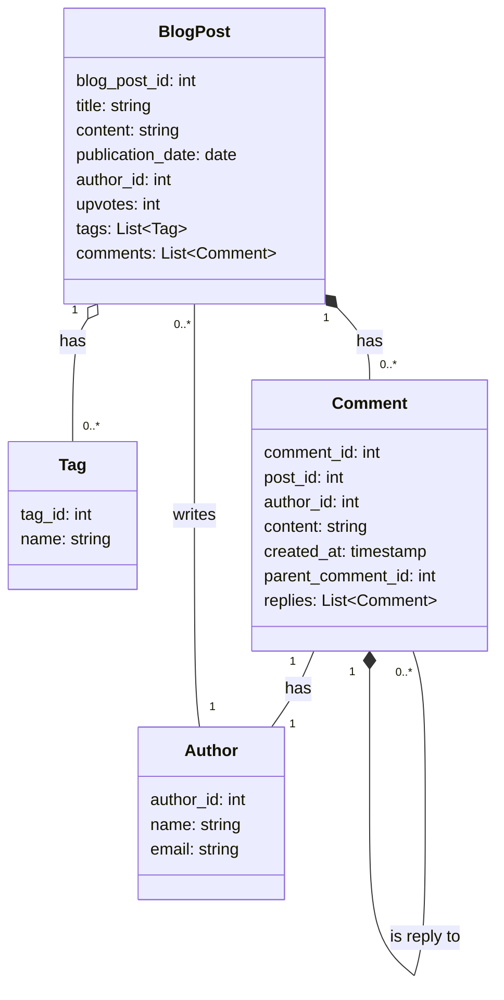

# Class Diagram

```mermaid
classDiagram
    class BlogPost {
        blog_post_id: int
        title: string
        content: string
        publication_date: date
        author_id: int
        upvotes: int
        tags: List~Tag~
        comments: List~Comment~
    }

    class Tag {
        tag_id: int
        name: string
    }

    class Author {
        author_id: int
        name: string
        email: string
    }

    class Comment {
        comment_id: int
        post_id: int
        author_id: int
        content: string
        created_at: timestamp
        parent_comment_id: int
        replies: List~Comment~
    }

    BlogPost "1" o-- "0..*" Tag : has
    Author "1" -- "0..*" BlogPost : writes
    BlogPost "1" *-- "0..*" Comment : has
    Comment "1" -- "1" Author : has
    Comment "0..*" --* "1" Comment : is reply to
```