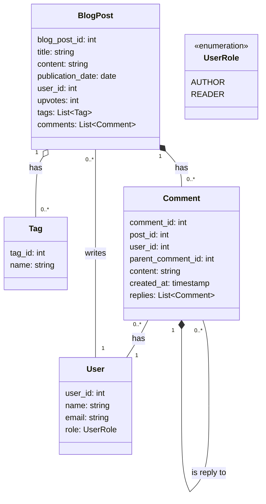

# Class Diagram

```mermaid
classDiagram
    class BlogPost {
        blog_post_id: int
        title: string
        content: string
        publication_date: date
        user_id: int
        upvotes: int
        tags: List~Tag~
        comments: List~Comment~
    }

    class Tag {
        tag_id: int
        name: string
    }

    class User {
        user_id: int
        name: string
        email: string
        role: UserRole  
    }
    
    class UserRole {
        <<enumeration>>
        AUTHOR
        READER
    }

    class Comment {
        comment_id: int
        post_id: int
        user_id: int
        parent_comment_id: int
        content: string
        created_at: timestamp
        replies: List~Comment~
    }

    BlogPost "1" o-- "0..*" Tag: has
    User "1" -- "0..*" BlogPost: writes
    BlogPost "1" *-- "0..*" Comment: has
    Comment "0..*" -- "1" User: has
    Comment "0..*" --* "1" Comment: is reply to
```