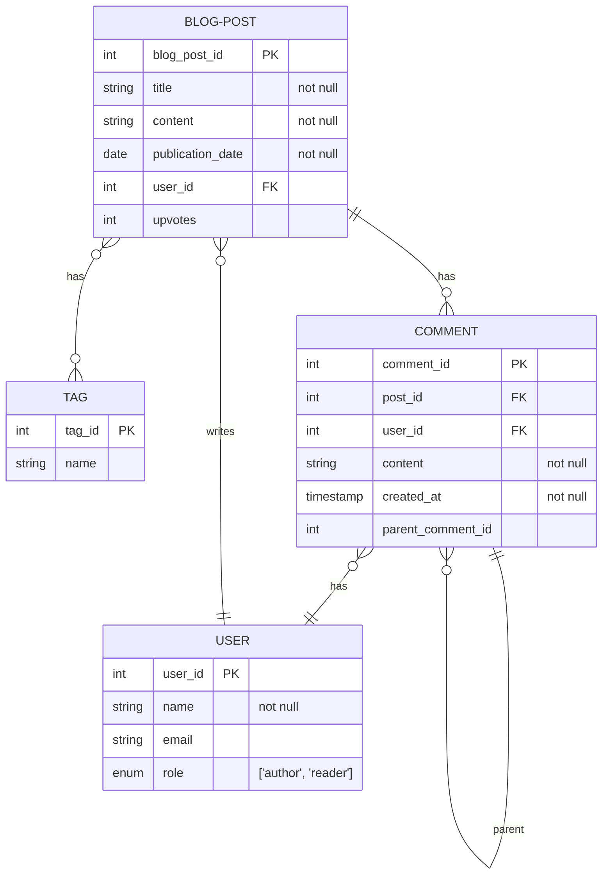

# ER Diagram

```mermaid
erDiagram
    BLOG-POST {
        int blog_post_id PK
        string title "not null"
        string content "not null"
        date publication_date "not null" 
        int user_id FK
        int upvotes
    }

    TAG {
        int tag_id PK
        string name
    }
    
    USER {
        int user_id PK
        string name "not null"
        string email
        enum role "['author', 'reader']"
    }
    
    COMMENT {
        int comment_id PK
        int post_id FK
        int user_id FK
        string content "not null"
        timestamp created_at "not null"
        int parent_comment_id
    }

    BLOG-POST }o--o{ TAG : has
    USER ||--o{ BLOG-POST : writes
    BLOG-POST ||--o{ COMMENT : has
    COMMENT }o--|| USER : has
    COMMENT ||--o{ COMMENT : parent
```